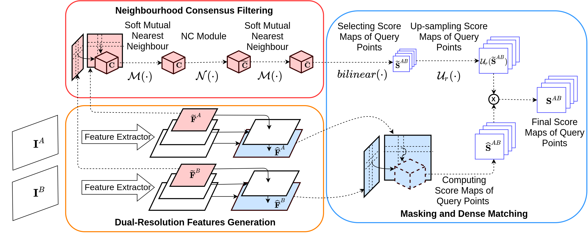

# Dual-Resolution Correspondence Network
[**Dual-Resolution Correspondence Network, NeurIPS 2020**](https://dualrcnet.active.vision/)


## Dependency
All dependencies are included in `asset/dualrcnet.yml`. You need to install [conda](https://docs.conda.io/en/latest/miniconda.html)
first, and then run
```
conda env create --file asset/dualrcnet.yml 
```
To activate the environment, run
```
conda activate dualrcnet
```
## Preparing data
We train our model on [MegaDepth](https://www.cs.cornell.edu/projects/megadepth/) dataset. To prepare for the data, you need
to download the **MegaDepth SfM models** from the [MegaDepth](https://www.cs.cornell.edu/projects/megadepth/) website and 
download `training_pairs.txt` and `validation_pairs.txt` from this [link](https://drive.google.com/drive/folders/1_Ha3xY_1u9Wpb7oV8rEr0Jy8mL3HGnp9?usp=sharing).
Then place both `training_pairs.txt` and `validation_pairs.txt` files under the downloaded directory `MegaDepth_v1_SfM`.

## Training
After downloading the training data, run
```
python train.py --training_file path/to/training_pairs.txt --validation_file path/to/validation_pairs.txt --image_path path/to/MegaDepth_v1_SfM
```

## Pre-trained model
We also provide our pre-trained model. You can download `dualrc-net.pth.tar` from this [link](https://drive.google.com/drive/folders/1_Ha3xY_1u9Wpb7oV8rEr0Jy8mL3HGnp9?usp=sharing)
and place it under the directory `trained_models`.

## Evaluation on HPatches
The dataset can be downloaded from [HPatches](https://github.com/hpatches/hpatches-dataset) repo. You need to download 
**HPatches full sequences**.\
After downloading the dataset, then:
1. Browse to `HPatches/`
2. Run `python eval_hpatches.py --checkpoint path/to/model --root path/to/parent/directory/of/hpatches_sequences`. This will
generate a text file which stores the result in current directory.
3. Open `draw_graph.py`. Change relevent path accordingly and run the script to draw the result.

We provide results of DualRC-Net alongside with results of other methods in directory `cache-top`.

## Evaluation on InLoc
In order to run the InLoc evaluation, you first need to clone the [InLoc demo repo](https://github.com/HajimeTaira/InLoc_demo), and download and compile all the required depedencies. Then:

1. Browse to `inloc/`. 
2. Run `python eval_inloc_extract.py` adjusting the checkpoint and experiment name.
This will generate a series of matches files in the `inloc/matches/` directory that then need to be fed to the InLoc evaluation Matlab code. 
3. Modify the `inloc/eval_inloc_compute_poses.m` file provided to indicate the path of the InLoc demo repo, and the name of the experiment (the particular directory name inside `inloc/matches/`), and run it using Matlab.
4. Use the `inloc/eval_inloc_generate_plot.m` file to plot the results from shortlist file generated in the previous stage: `/your_path_to/InLoc_demo_old/experiment_name/shortlist_densePV.mat`. Precomputed shortlist files are provided in `inloc/shortlist`.

## Evaluation on Aachen Day-Night
In order to run the Aachen Day-Night evaluation, you first need to clone the [Visualization benchmark repo](https://github.com/tsattler/visuallocalizationbenchmark), and download and compile [all the required depedencies](https://github.com/tsattler/visuallocalizationbenchmark/tree/master/local_feature_evaluation) (note that you'll need to compile Colmap if you have not done so yet). Then:

1. Browse to `aachen_day_and_night/`. 
2. Run `python eval_aachen_extract.py` adjusting the checkpoint and experiment name.
3. Copy the `eval_aachen_reconstruct.py` file to `visuallocalizationbenchmark/local_feature_evaluation` and run it in the following way:

```
python eval_aachen_reconstruct.py 
	--dataset_path /path_to_aachen/aachen 
	--colmap_path /local/colmap/build/src/exe
	--method_name experiment_name
```
4. Upload the file `/path_to_aachen/aachen/Aachen_eval_[experiment_name].txt` to `https://www.visuallocalization.net/` to get the results on this benchmark.

## BibTex
If you use this code, please cite our paper
```bibtex
@inproceedings{Li2020Dual,
author    = {Xinghui Li and Kai Han and Shuda Li and Victor Prisacariu},
title     = {Dual-Resolution Correspondence Networks},
booktitle = {Conference on Neural Information Processing Systems (NeurIPS)},
year      = {2020},
}
```

## Acknowledgement
Our code is based on the wonderful code provided by [NCNet](https://www.di.ens.fr/willow/research/ncnet/), [Sparse-NCNet](https://www.di.ens.fr/willow/research/sparse-ncnet/) and [ANC-Net](https://ancnet.active.vision/).
